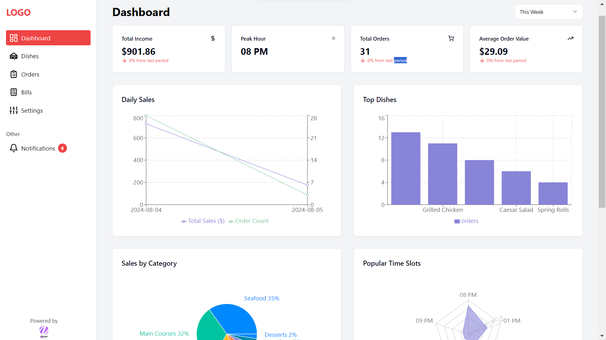
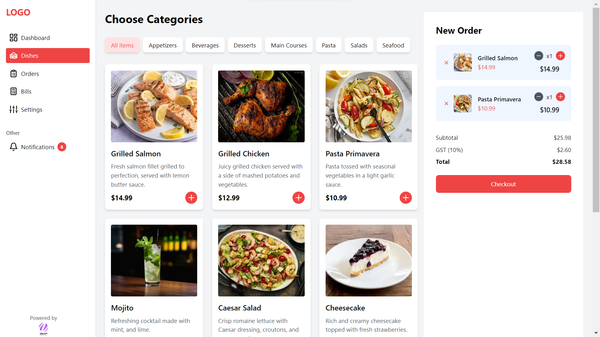
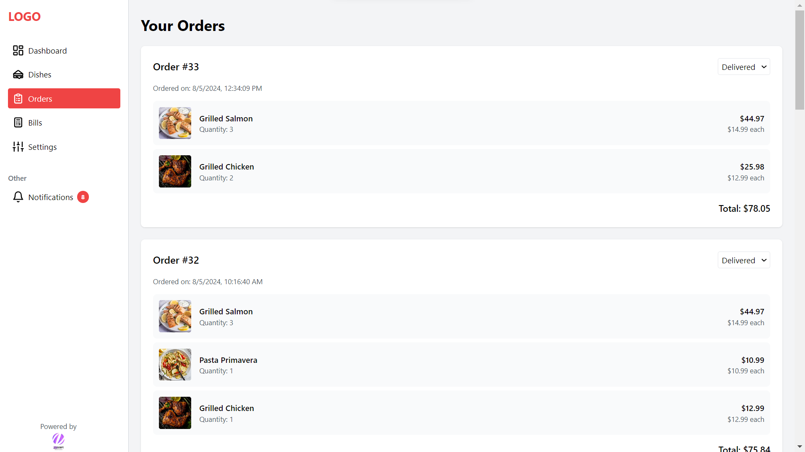

# Restaurant Management Application

## Overview

This project is a full-stack Restaurant Management Application developed by Nasscript. It provides a comprehensive solution for managing restaurant operations, including dish management, order processing, billing, and analytics.

## Features

- Dish listing and category management
- Order creation and checkout
- Bill generation and listing
- Notifications for new orders and bills
- Analytics dashboard with insights on:
  - Total income
  - Peak hours
  - Average order value
  - Daily sales charts
  - Top dishes
  - Sales by category
  - Popular time slots

[Watch the video](documentation/videos/Overview.mp4)

## Tech Stack

- Frontend: React with TypeScript, Tailwind CSS
- Backend: Django, Django Rest Framework
- Database: SQLite

## Prerequisites

Before you begin, ensure you have the following installed:
- Git
- Python (3.8 or higher)
- Node.js (14.0 or higher)
- npm (6.0 or higher)

## Installation

### Backend Setup

1. Clone the repository:
   ```
   git clone https://github.com/mohd-shibilicv/nasscript_restaurant_project.git
   ```

2. Navigate to the backend directory:
   ```
   cd backend
   ```

3. Create a virtual environment:
   ```
   python -m venv venv
   ```

4. Activate the virtual environment:
   - On Windows:
     ```
     venv\Scripts\activate
     ```
   - On macOS and Linux:
     ```
     source venv/bin/activate
     ```

5. Install dependencies:
   ```
   pip install -r requirements.txt
   ```

6. Set up environment variables:
   ```
   cp env.example .env
   ```
   Edit the `.env` file and configure it with your settings.

7. Run migrations:
   ```
   python manage.py makemigrations
   python manage.py migrate
   ```

8. Start the Django development server:
   ```
   python manage.py runserver 8000
   ```

### Frontend Setup

1. Navigate to the frontend directory:
   ```
   cd frontend
   ```

2. Install dependencies:
   ```
   npm install
   ```

3. Start the development server:
   ```
   npm run dev
   ```

The frontend will be available at `http://localhost:5173`.

## Usage

Here's a brief guide on how to use the application:

1. Access the frontend at `http://localhost:5173`
2. Log in or create an account
3. Explore the various features:
   - Manage dishes and categories
   - Create and process orders
   - Generate and view bills
   - Check notifications
   - Analyze restaurant performance through the dashboard

Dashboard


Dishes


Orders


## API Documentation

The API endpoints are available at `http://127.0.0.1:8000/api/`.

## Contributing

We welcome contributions to improve the Restaurant Management Application. Please follow these steps:

1. Fork the repository
2. Create a new branch (`git checkout -b feature/AmazingFeature`)
3. Commit your changes (`git commit -m 'Add some AmazingFeature'`)
4. Push to the branch (`git push origin feature/AmazingFeature`)
5. Open a Pull Request

## Thank you world for the support!